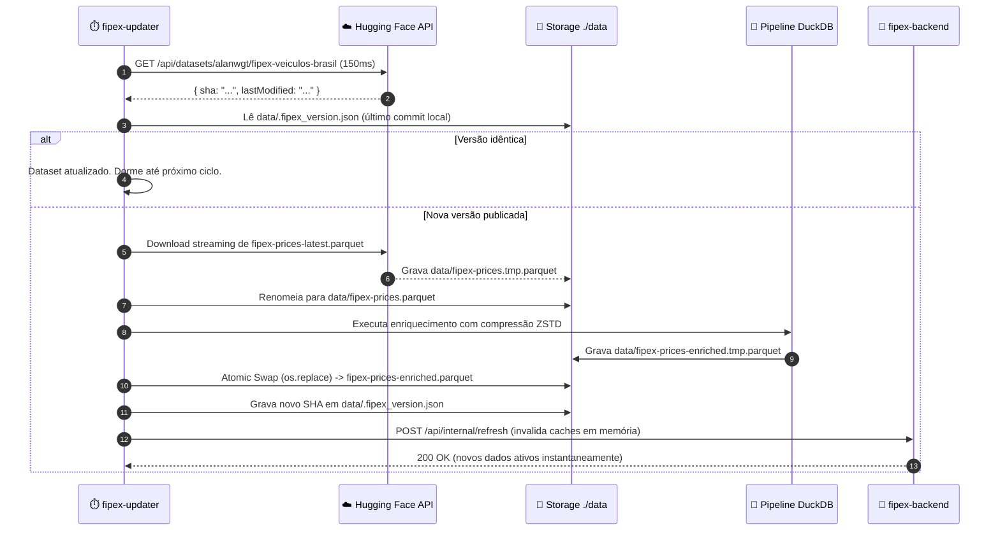

# FIPEX Explorer 🚗💨
> Visualizador Analítico e Consultor de Orçamento para a Tabela FIPE (9.58M de registros históricos em Parquet com DuckDB, Backend em Camadas, Frontend em TypeScript e Deploy de Produção com Cloudflare Tunnel).

Agradecimento especial ao [alanwgt/fipex-veiculos-brasil](https://huggingface.co/datasets/alanwgt/fipex-veiculos-brasil) no Hugging Face pelo dataset mensal atualizado da Tabela FIPE.

---

## 🏗️ Arquitetura do Sistema

```
fipe-explorer/
├── backend/                       # Backend Modular em Camadas (SOLID & DRY)
│   ├── core/                      # Configurações, DuckDB jail, TTLCache, Rate Limiter
│   ├── domain/                    # Cálculos puros (CAGR, desvalorização, regras de transmissão)
│   ├── schemas/                   # DTOs e validações com Pydantic v2
│   ├── repositories/              # Execuções SQL otimizadas no DuckDB
│   ├── services/                  # Orquestração de negócio e caching TTL
│   └── api/v1/                    # Endpoints REST (/api/health, /presets, /search, /history, /filters)
├── frontend/                      # Frontend SPA Moderno em TypeScript
│   ├── src/types/                 # Definições de domínio e DTOs tipados (TypeScript estrito)
│   ├── src/services/api.ts        # Cliente de API centralizado e tipado
│   ├── src/components/ui/         # Primitivas UI inspiradas no design system Supabase
│   └── src/components/            # Telas de visualização, gráficos (Chart.js) e comparador
├── scripts/
│   ├── update_dataset.py          # Automação de checagem, download e atomic swap do Hugging Face
│   └── enrich_parquet.py          # Pipeline DuckDB de pré-cálculo e enriquecimento
├── data/                          # Armazenamento local do dataset Parquet (:ro no backend)
├── docker-compose.yml             # Orquestração completa de produção (Backend + Frontend + Tunnel + Updater)
└── server.py                      # Entrypoint Uvicorn
```

---

## 🔄 Automação Mensal do Dataset FIPE (Hugging Face)

Todo início de mês, a FIPE publica novos preços e o repositório [`alanwgt/fipex-veiculos-brasil`](https://huggingface.co/datasets/alanwgt/fipex-veiculos-brasil) disponibiliza a base consolidada atualizada (`fipex-prices-latest.parquet`).

O **FIPEX Explorer** possui um subsistema automatizado de atualização com **Zero Downtime**:



### Como Executar a Atualização:

#### 1. Modo Automático (Docker Compose)
O serviço `updater` já roda em background no `docker-compose.yml`, checando o Hugging Face a cada 24 horas (ou no intervalo configurado em `UPDATE_INTERVAL_HOURS`):
```bash
docker compose up -d
```

#### 2. Execução Manual Sob Demanda (CLI)
Para verificar ou forçar a atualização imediata:

```bash
# Apenas verificar se há nova versão sem baixar
python scripts/update_dataset.py --check

# Forçar download imediato e enriquecimento completo
python scripts/update_dataset.py --force

# Ou via Docker Compose
docker compose run --rm updater python scripts/update_dataset.py --force
```

---

## ⚡ Performance & Enriquecimento Pré-calculado

A aplicação utiliza um **formato analítico pré-calculado em Parquet com compressão Zstandard**, eliminando expressões regulares em tempo de consulta:

| Métrica | Antes (Regex em tempo real) | Depois (Colunas Pré-calculadas DuckDB) | Ganho |
| :--- | :--- | :--- | :--- |
| **Consulta Paginada** | ~1.440 ms | **41,7 ms** | **~34,5x mais rápido** |
| **Filtro Direto no Dataset** | ~1.175 ms | **7,2 ms** | **~162x mais rápido** |
| **Tamanho em Disco** | ~129 MB | **~59 MB** (ZSTD) | **Redução de 54%** |
| **Registros Totais** | - | **9.580.464 linhas históricas** | **Base completa** |

Colunas pré-calculadas pelo script `scripts/enrich_parquet.py`:
- `is_turbo`: Identificação precisa de turbos (`tsi`, `tgdi`, `thp`, `ecoboost`, etc.), sem falsos positivos.
- `is_automatico`: Transmissões automáticas (`aut`, `cvt`, `dsg`, `tiptronic`, e linhas BMW como `320i`, `328i`, `330i`, `118i`).
- `is_manual`: Câmbios manuais explicitamente rotulados.
- `litragem` e `litragem_num`: Cilindrada padronizada (`1.0`, `1.4`, `2.0`), permitindo filtros numéricos indexados.

---

## 🚀 Deploy de Produção (Coolify / VPS / Docker Compose)

### 1. Configurar Variáveis de Ambiente
Copie o arquivo de exemplo e preencha suas variáveis:
```bash
cp .env.example .env
```

Parâmetros principais no `.env`:
```env
# Porta HTTP local exposta no host (padrão 8085)
FRONTEND_PORT=8085

# Intervalo de checagem de atualizações do dataset (em horas)
UPDATE_INTERVAL_HOURS=24

# Cloudflare Tunnel (opcional, ativado com profile 'tunnel')
# COMPOSE_PROFILES=tunnel
# CLOUDFLARE_TUNNEL_TOKEN=ey...
```

### 2. Iniciar em Produção

```bash
# Via arquivo padrão (Coolify / Docker Compose):
docker compose up -d

# Ou explicitamente via docker-compose.prod.yml:
docker compose -f docker-compose.prod.yml up -d
```
Acesse no navegador: `http://localhost:8085` (ou na porta configurada em `FRONTEND_PORT`).

> **Com Cloudflare Tunnel:**
> ```bash
> docker compose --profile tunnel up -d
> ```

---

## 💻 Desenvolvimento com Docker (Dev Compose com Hot-Reload)

Para iterar rapidamente no código com **Hot Module Replacement (HMR)** no frontend e **Uvicorn --reload** no backend:

```bash
docker compose -f docker-compose.dev.yml up --build
```
- **Frontend Vite (HMR):** `http://localhost:3000`
- **Backend FastAPI (--reload):** `http://localhost:8000`
- **Swagger Docs:** `http://localhost:8000/docs`
- As alterações em `frontend/src/`, `backend/` e `server.py` refletem instantaneamente no navegador sem rebuild.

---

## 💻 Desenvolvimento Local

### 1. Backend (Python + FastAPI)
```bash
# Ativar ambiente virtual
source .venv/bin/activate

# Instalar dependências
pip install -r backend/requirements.txt

# Iniciar backend com auto-reload
uvicorn server:app --host 0.0.0.0 --port 8000 --reload
```
Acesse a documentação Swagger em: `http://localhost:8000/docs`.

### 2. Frontend (React + TypeScript + Vite)
```bash
cd frontend
npm install
npm run dev
```
Acesse a aplicação em: `http://localhost:3000`.

Para validar a tipagem TypeScript estrita e build:
```bash
npm run typecheck    # tsc --noEmit
npm run build        # tsc --noEmit && vite build
```

---

## 🛡️ Segurança e Proteção de Recursos
- **DuckDB Jail**: Limites configuráveis de memória RAM (`DUCKDB_MAX_MEMORY=1GB`) e threads paralelas (`DUCKDB_THREADS=2`).
- **Semáforo de Concorrência**: Limite máximo de consultas simultâneas no DuckDB com fila de espera e timeout para evitar exaustão de CPU.
- **Sliding Window Rate Limiter**: Proteção contra DDoS e scraping abusivo com suporte nativo aos cabeçalhos `CF-Connecting-IP` e `X-Forwarded-For`.
- **Contêineres Não-Root**: O backend executa com o usuário de sistema não-privilegiado `appuser` (UID 1000).
- **Montagem Somente Leitura**: O contêiner da API acessa o diretório de dados em modo `:ro` (`./data:/app/data:ro`), garantindo que a base de dados nunca seja alterada em tempo de requisição.

---

## 📄 Licença
Distribuído sob a licença MIT. Veja `LICENSE` para mais informações.
